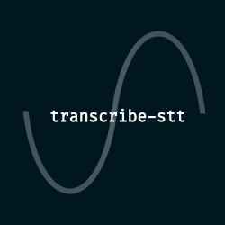

# transcribe-stt

Transcribe audio of any length using Google's Speech to Text API

## Contents

- [Description](#description)
- [Installation](#installation)
- [Reference](#reference)
- [Google authentication](#google-authentication)
- [Converting audio to a WAV file](#converting-audio-to-a-wav-file)
  - [Checking encoding and sample rate](#checking-encoding-and-sample-rate)
    - [Encoding](#encoding)
    - [Sample rate](#sampler-rate)
- [To do](#to-do)

## Description

Transcribe audio of any length using [Google's Speech to Text API] with its [`Node client`](https://www.npmjs.com/package/@google-cloud/speech)

## Installation

```
npm i transcribe-stt
```

## Reference

See the [reference documentation](https://github.com/EmmaGoodliffe/transcribe-stt/blob/master/docs/md/index.md)

## Google authentication

To stream any audio, you must authenticate yourself with Google. To do this, just follow the steps below

1. Complete step 1 (only) of [Google's "quickstart" guide](https://cloud.google.com/speech-to-text/docs/quickstart-client-libraries#before-you-begin) to create a GCP project and a private key. Save the private key in your project. (In this guide, we will call it `key.json`)
1. Make sure any repo utilities ignore your new JSON key, e.g. by adding it to a `.gitignore`:
   ```
   key.json
   ```
1. Change the value of the environment variable `GOOGLE_APPLICATION_CREDENTIALS` to the **absolute** path to your JSON key. There are multiple ways to do this. The easiest way is probably [`dotenv`]

   - [`dotenv`] (a package for easily defining environment variables)

     1. Create a file called `.env` and add it to any `.gitignore`/etc in the same way as the JSON key
     1. In your `.env`, add a line as follows, replacing `PATH` with the absolute path to your JSON key
        ```
        GOOGLE_APPLICATION_CREDENTIALS=PATH
        ```
     1. Install [`dotenv`]
        ```
        npm i dotenv --save-dev
        ```
     1. Configure [`dotenv`] before using any `transcribe-stt` services

        ```ts
        import { config } from "dotenv";
        // Or in JavaScript: const { config } = require("dotenv");

        config();
        ```

     1. Done!

   - Directly through Node

     1. Before using any `transcribe-stt` services, define the environment variable

        ```ts
        import { resolve } from "path";
        // Or in JavaScript: const { resolve } = require("path");

        // Define relative path
        const relGoogleKeyFilename = "./key.json";
        // Convert to absolute path
        const absGoogleKeyFilename = resolve(__dirname, relGoogleKeyFilename);
        // Save to environment variable
        process.env.GOOGLE_APPLICATION_CREDENTIALS = absGoogleKeyFilename;
        ```

        Define the relative path relative to the directory that the script is in.

     1. Done!

   - Command-line/shell
     1. Define environment variable, replacing `PATH` with the absolute path to your JSON key
        - Linux/macOS
          ```
          export GOOGLE_APPLICATION_CREDENTIALS="PATH"
          ```
        - Windows
          - PowerShell
            ```
            $env:GOOGLE_APPLICATION_CREDENTIALS="PATH"
            ```
          - Command prompt
            ```
            set GOOGLE_APPLICATION_CREDENTIALS=PATH
            ```
     1. Done!

## Converting audio to a WAV file

To use an audio file with `transcribe-stt`, it must be a WAV file with mono audio. This is a simple guide to converting audio files with an editor, specifically [Audacity] which is free and available on all 3 major operating systems. However, many of the steps will be very similar on any audio editing software

1. Open the editor and import your audio
   > File > Import > Audio...
1. Select all
   > Select > All
1. Convert to mono if necessary
   > Tracks > Mix > Mix Stereo Down to Mono
1. Optionally check or change the sample rate (and remember it for later)
   > Tracks > Resample...
1. Export as WAV file
   > Export > Export as WAV
1. Optionally change the encoding. When the export dialogue appears, there is an option to "Save as type" where you can choose what encoding you want (and remember it for later). Learn more about encodings [below](#encoding)

### Checking encoding and sample rate

If you're using Linux or macOS you can run this to print out some info about your audio file usually including the encoding and sample rate

```
file <input WAV file>
```

#### Encoding

Encodings often go by multiple aliases. For example, "LINEAR16" is often listed by the `file` command and other methods as "Microsoft PCM 16 bit". Because of this, it can be difficult to find which encoding you have and whether it is supported by [Google's Speech to Text API]. The list of supported encodings is [here](https://cloud.google.com/speech-to-text/docs/encoding) (and usually you can find the aliases of your encoding with not too much research)

If you can't run the `file` command, [Audacity] can be used to change the encoding of the file as documented [above](#converting-audio-to-a-wav-file)

#### Sample rate

Similarly, if you can't run the `file` command, [Audacity] can show you the sample rate or change it if you need using the method [above](#converting-audio-to-a-wav-file)

## To do

- Create development guide
- Use docker
- Document how to change to a WAV file programmatically
- Allow advanced configuration options documented [here](https://cloud.google.com/speech-to-text/docs/reference/rpc/google.cloud.speech.v1#google.cloud.speech.v1.StreamingRecognitionConfig)
- Lint `.svg` files
- Update examples in JSDoc comments
- Check exports from `.ts` files are used

[audacity]: https://www.audacityteam.org/
[google's speech to text api]: https://cloud.google.com/speech-to-text/
[`dotenv`]: https://www.npmjs.com/package/dotenv
